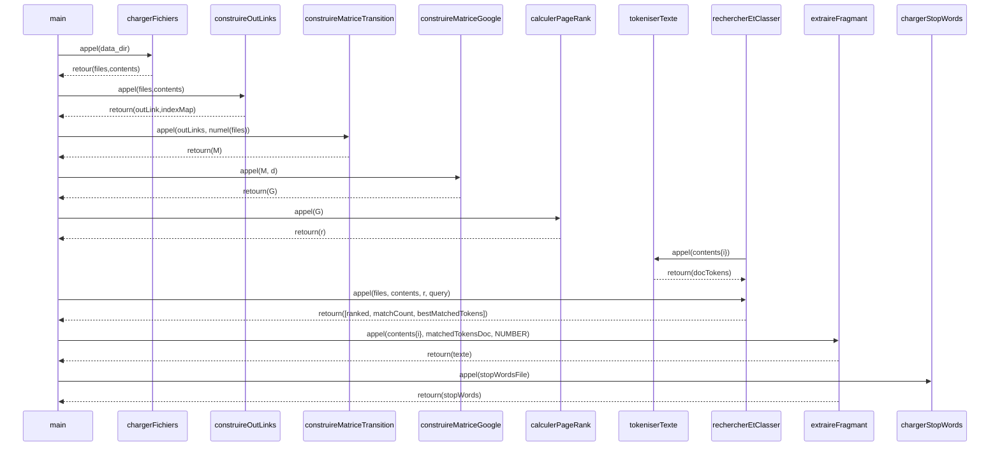

## Moteur de recherche basé sur PageRank

### Objectif :
Implémenter le moteur de recherche de **Google** utilisant :
* Documents interconnectés
* Matrice de transition
* Matrice Google

### Structure du projet et des données

#### Aborescence des repertoires
    src/            <---- Repertoire des différentes fonctions
        chargerFichiers.m
        construireOutLinks.m
        construireMatriceTransition.m
        construireMatriceGoogle.m
        calculerPageRank.m
        rechercherEtClasser.m
        extraireFragmant.m
        tokeniserTexte.m
        chargerStopWords.m
    data/           <---- Repertoire à créer pour mettre les fichiers avec pour extension txt
    main.m          <---- Fichier principal
    logique.m       <---- Fichier d'établissement de la logique de calculs

#### Structure des fichiers
Les fichiers se trouvant dans `data/` doivent avoir pour extension `txt` avec pour encodage **UTF-8**. Ils sont liés par cette nommenclature : `[pointeur](nom_fichier_pointé)`

#### Chaîne d'appels principale

### Pipeline détaillé 

1) Indexation des documents

* Scan des fichiers `.txt`
* Création de la matrice de transition

2) Calcul de la popularité : 

*G = dM + (1-d)**1**/N*

où :
- M = matrice de transition
- d = facteur d’amortissement (0.85)
- N = nombre de documents
- **1** = Matrice Unitaire

3) Recherche multi-mots

La requête utilisateur est :
- Tokenisée (tokeniserTexte)
- Comparée document par document
- Score = nombre de mots distincts matchés

Classement final :

a. Pertinence (nb mots matchés)

b. PageRank (tie-break)

4) Snippet intelligent

Pour le meilleur résultat :
- Extraction d’une fenêtre de texte
- Mise en évidence des mots trouvés

5) Filtrage des stop words 
- suppression des mots grammaticaux non discriminants 
- amélioration du ratio signal/bruit 

- Impact : 
    * réduction des faux ex aequo 

    * meilleure précision sur requêtes naturelles

#### Remarque 
 Vous trouverez un jeu de données dans ce drive : [data-DocSeek](https://drive.google.com/drive/folders/1dRWoZwnUrjZczquFge0bXWuwygNukN45?usp=sharing)
 dont le contexte est un ensemble d'installation d'outils pour un *HomeLab*.
 
 **NB :** Renommer le repertoire `data/`

